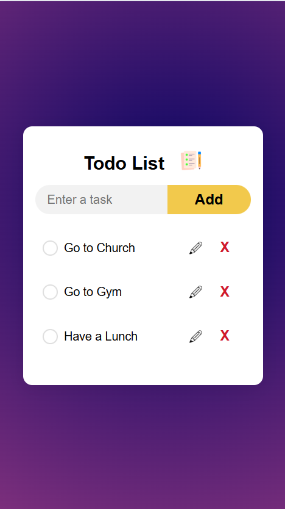

# Todo List Web App

A simple, modern, and responsive Todo List web application built with HTML, CSS, and JavaScript. This app allows you to add, edit, delete, and check off tasks, with all data saved in your browser's local storage for persistence.

## Features

- Add new tasks
- Edit existing tasks (with UI lock during editing)
- Delete tasks
- Mark tasks as completed (with visual feedback)
- Responsive design for mobile and desktop
- Accessible and keyboard-friendly
- Data persists using localStorage

## Getting Started

### Prerequisites

- A modern web browser (Chrome, Firefox, Edge, Safari, etc.)
- No installation or backend required

### Running the App

1. Clone or download this repository to your local machine.
2. Open the `HTML/index.html` file in your web browser.

```
project-root/
├── HTML/
│   └── index.html
├── CSS/
│   └── style.css
├── JS/
│   └── script.js
├── images/
│   ├── icon.png
│   ├── checked.png
│   ├── unchecked.png
│   └── pencil_icon.png
└── README.md
```

## Usage

- Enter a task in the input field and click **Add** or press **Enter**.
- Click the pencil icon to edit a task. Only one task can be edited at a time.
- Click the **X** button to delete a task.
- Click on a task row to mark it as completed (checked).

## Screenshots

### Main Todo List Page


_The main interface: add, edit, delete, and check off your tasks. Responsive and accessible._

### Editing a Task


_Edit mode: the UI is locked until you finish editing or cancel. Prevents accidental changes._

### Mobile View


_Responsive design: the app adapts to smaller screens for a smooth mobile experience._
isible, please ensure you have the following files in your `images/` directory:


## Accessibility & Best Practices

- Keyboard navigation supported
- Focus indicators for all interactive elements
- ARIA labels and roles for assistive technologies

## License

This project is open source and free to use for any purpose.

---

**Enjoy your organized day!**
